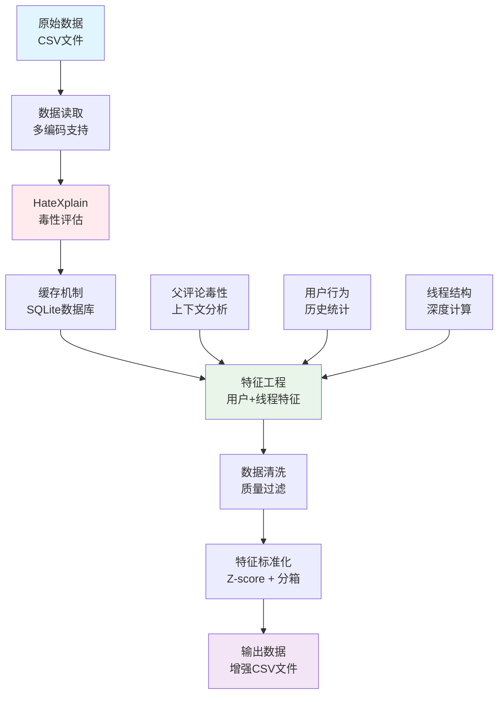
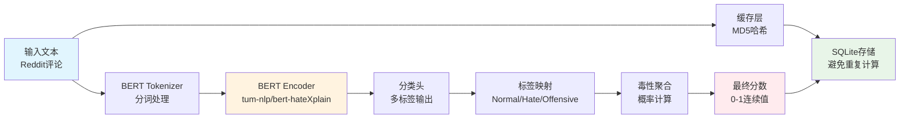
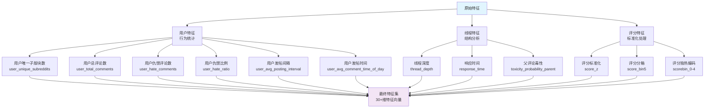

# Retrain模型重训练与数据预处理分析报告

## 概述

Retrain脚本是一个专门用于仇恨言论数据预处理和重新标注的工具，使用HateXplain预训练模型对Reddit评论数据进行毒性评估和特征工程。

## 核心功能

### 1. 数据重新标注
- 使用HateXplain BERT模型对原始评论进行毒性评估
- 生成连续毒性概率分数（0-1范围）
- 支持批量处理和缓存机制

### 2. 特征工程
- 用户行为特征提取
- 线程深度计算
- 评分标准化和分箱
- 上下文毒性分析

### 3. 数据清洗
- 过滤低质量线程（深度<3）
- 移除低频子版块（出现次数<5）
- 处理编码问题和异常数据

## 架构图

### 数据处理流程


### HateXplain模型架构


### 特征工程架构


## 关键组件分析

### 1. HateXplain集成
```python
# 模型加载
tokenizer = AutoTokenizer.from_pretrained("tum-nlp/bert-hateXplain")
model = AutoModelForSequenceClassification.from_pretrained("tum-nlp/bert-hateXplain")
clf = pipeline("text-classification", model=model, tokenizer=tokenizer)

# 毒性分数计算
def tox_from_labels(lbls):
    s = 0.0
    for d in lbls:
        L = str(d["label"]).lower()
        # 跳过非毒性标签
        if ("normal" in L) or ("neutral" in L) or ("non-toxic" in L):
            continue
        s += float(d["score"])
    return 0.0 if s < 0 else (1.0 if s > 1 else s)
```

**特点**：
- 使用预训练的HateXplain BERT模型
- 支持多标签分类（Normal/Hate/Offensive）
- 自动聚合多个标签的置信度分数
- 输出0-1范围的连续毒性分数

### 2. 缓存机制
```python
# SQLite缓存数据库
def db_init():
    conn = sqlite3.connect(cache_db)
    cur = conn.cursor()
    cur.execute("CREATE TABLE IF NOT EXISTS pred_cache (k TEXT PRIMARY KEY, p REAL)")
    return conn

# MD5哈希键生成
def md5(s):
    return hashlib.md5(s.encode("utf-8","ignore")).hexdigest()
```

**优势**：
- 避免重复计算相同文本的毒性分数
- 使用MD5哈希作为缓存键
- SQLite数据库持久化存储
- 支持批量查询和插入

### 3. 用户特征工程
```python
def build_user_feats_binary(df, cls_col="class_self"):
    g = df.groupby("author", dropna=False)
    uniq = g["subreddit"].nunique().rename("user_unique_subreddits")
    total = g.size().rename("user_total_comments")
    hate = g[cls_col].apply(lambda s: (s=="toxic").sum()).rename("user_hate_comments")
    ratio = (hate/total.replace(0,np.nan)).fillna(0).rename("user_hate_ratio")
    # ... 更多特征
```

**特征类型**：
- **行为特征**：总评论数、唯一子版块数、发帖间隔
- **毒性特征**：仇恨评论数、仇恨比例
- **时间特征**：平均发帖时间、响应时间

### 4. 数据清洗策略
```python
# 线程深度过滤
link_max = df.groupby("link_id")["thread_depth"].max()
keep_links = set(link_max[link_max >= 3].index)
df = df[df["link_id"].isin(keep_links)]

# 子版块频率过滤
sr_counts = df["subreddit"].value_counts()
keep_srs = set(sr_counts[sr_counts >= 5].index)
df = df[df["subreddit"].isin(keep_srs)]
```

**清洗规则**：
- 移除深度<3的线程（质量较低）
- 移除出现次数<5的子版块（数据稀疏）
- 支持宽松过滤模式（深度≥2，频率≥2）

## 输出特征说明

### 核心特征（30+维）
| 特征类别 | 特征名称 | 描述 | 类型 |
|---------|---------|------|------|
| **基础信息** | id, parent_id, link_id | 评论标识符 | 字符串 |
| | author, subreddit | 作者和子版块 | 字符串 |
| | created_utc, body | 时间戳和内容 | 数值/文本 |
| **毒性评估** | toxicity_probability_self | 自身毒性概率 | 连续值(0-1) |
| | toxicity_probability_parent | 父评论毒性概率 | 连续值(0-1) |
| | class_self | 毒性分类标签 | 二分类 |
| **线程特征** | thread_depth | 线程深度 | 整数 |
| | response_time | 响应时间 | 数值 |
| **评分特征** | score_f, score_z | 原始和标准化评分 | 数值 |
| | score_bin5 | 评分分箱(0-4) | 整数 |
| | scorebin_0-4 | 评分独热编码 | 二进制 |
| **用户特征** | user_total_comments | 用户总评论数 | 整数 |
| | user_unique_subreddits | 用户唯一子版块数 | 整数 |
| | user_hate_comments | 用户仇恨评论数 | 整数 |
| | user_hate_ratio | 用户仇恨比例 | 比例(0-1) |
| | user_avg_posting_interval | 平均发帖间隔 | 数值 |
| | user_avg_comment_time_of_day | 平均发帖时间 | 数值 |

### 标签泄漏防护
**移除的特征**：
- `toxicity_probability_self` - 目标变量，不应作为输入特征
- `hate_score_self` - 基于目标变量计算，存在泄漏

**保留的特征**：
- `toxicity_probability_parent` - 上下文信息，允许使用
- `hate_score_ctx` - 基于父评论计算，无泄漏风险

## 性能优化

### 1. 批处理策略
```python
def batched_predict(texts, bs=192, max_len=256):
    # 动态批大小调整
    cur_bs = bs
    while i < len(miss):
        try:
            res = clf(batch, batch_size=cur_bs, max_length=max_len)
        except RuntimeError as e:
            if "CUDA out of memory" and cur_bs > 1:
                cur_bs = max(1, cur_bs // 2)  # 减半批大小
```

### 2. 内存管理
```python
# 显存清理
if device == "cuda": 
    torch.cuda.empty_cache()

# 垃圾回收
del df
gc.collect()
```

### 3. 编码处理
```python
def read_df_cp775(path, nrows=None):
    encodings_to_try = ["utf-8", "cp775", "latin-1"]
    for encoding in encodings_to_try:
        try:
            df = pd.read_csv(path, encoding=encoding, ...)
            break
        except UnicodeDecodeError:
            continue
```

## 使用示例

### 基本用法
```bash
# 处理所有数据集
python retrain.py --mode full

# 处理特定数据集
python retrain.py --splits train valid

# 调整参数
python retrain.py --bs 128 --tau 0.3 --parent compute
```

### 参数说明
| 参数 | 默认值 | 说明 |
|------|--------|------|
| `--mode` | full | 处理模式：full/sample |
| `--n` | 1000 | 采样数量（sample模式） |
| `--bs` | 192 | 批处理大小 |
| `--tau` | 0.5 | 毒性分类阈值 |
| `--parent` | reuse | 父评论处理策略 |
| `--timing` | False | 是否显示时间统计 |

## 数据质量保证

### 1. 统计报告
```python
print(f"[FINAL STATS] {out_path}:")
print(f"  Rows: {len(df)}")
print(f"  Continuous hate score:")
print(f"    Min: {df['toxicity_probability_self'].min():.3f}")
print(f"    Max: {df['toxicity_probability_self'].max():.3f}")
print(f"    Mean: {df['toxicity_probability_self'].mean():.3f}")
```

### 2. 数据验证
- 检查特征完整性
- 验证数值范围合理性
- 确保无标签泄漏
- 统计过滤效果

## 总结

Retrain脚本是一个功能完整的数据预处理工具，具有以下特点：

1. **智能化标注**：使用先进的HateXplain模型进行毒性评估
2. **高效缓存**：避免重复计算，提高处理效率
3. **丰富特征**：提取30+维用户和线程特征
4. **质量保证**：多层数据清洗和验证机制
5. **防泄漏设计**：严格避免标签泄漏问题

该工具为后续的TGNN模型训练提供了高质量、多维度的特征数据，是仇恨言论检测系统的重要组成部分。
