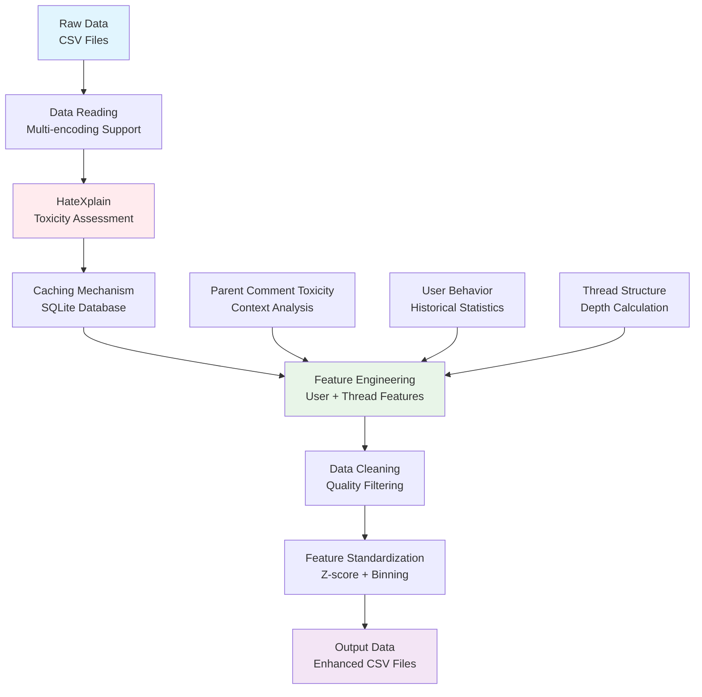
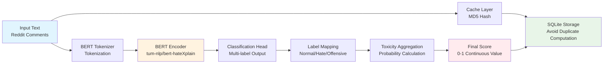
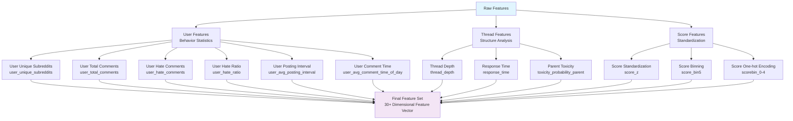

# Retrain Model Retraining and Data Preprocessing Analysis Report

## Overview

The Retrain script is a specialized tool for hate speech data preprocessing and re-labeling, using the HateXplain pre-trained model to evaluate toxicity and perform feature engineering on Reddit comment data.

## Core Functionality

### 1. Data Re-labeling
- Uses HateXplain BERT model to evaluate toxicity of original comments
- Generates continuous toxicity probability scores (0-1 range)
- Supports batch processing and caching mechanisms

### 2. Feature Engineering
- User behavior feature extraction
- Thread depth calculation
- Score standardization and binning
- Context toxicity analysis

### 3. Data Cleaning
- Filters low-quality threads (depth < 3)
- Removes low-frequency subreddits (occurrence < 5)
- Handles encoding issues and anomalous data

## Architecture Diagrams

### Data Processing Flow


### HateXplain Model Architecture


### Feature Engineering Architecture


## Key Components Analysis

### 1. HateXplain Integration
```python
# Model Loading
tokenizer = AutoTokenizer.from_pretrained("tum-nlp/bert-hateXplain")
model = AutoModelForSequenceClassification.from_pretrained("tum-nlp/bert-hateXplain")
clf = pipeline("text-classification", model=model, tokenizer=tokenizer)

# Toxicity Score Calculation
def tox_from_labels(lbls):
    s = 0.0
    for d in lbls:
        L = str(d["label"]).lower()
        # Skip non-toxic labels
        if ("normal" in L) or ("neutral" in L) or ("non-toxic" in L):
            continue
        s += float(d["score"])
    return 0.0 if s < 0 else (1.0 if s > 1 else s)
```

**Features**:
- Uses pre-trained HateXplain BERT model
- Supports multi-label classification (Normal/Hate/Offensive)
- Automatically aggregates confidence scores from multiple labels
- Outputs continuous toxicity scores in 0-1 range

### 2. Caching Mechanism
```python
# SQLite Cache Database
def db_init():
    conn = sqlite3.connect(cache_db)
    cur = conn.cursor()
    cur.execute("CREATE TABLE IF NOT EXISTS pred_cache (k TEXT PRIMARY KEY, p REAL)")
    return conn

# MD5 Hash Key Generation
def md5(s):
    return hashlib.md5(s.encode("utf-8","ignore")).hexdigest()
```

**Advantages**:
- Avoids duplicate computation of toxicity scores for identical text
- Uses MD5 hash as cache key
- SQLite database for persistent storage
- Supports batch queries and inserts

### 3. User Feature Engineering
```python
def build_user_feats_binary(df, cls_col="class_self"):
    g = df.groupby("author", dropna=False)
    uniq = g["subreddit"].nunique().rename("user_unique_subreddits")
    total = g.size().rename("user_total_comments")
    hate = g[cls_col].apply(lambda s: (s=="toxic").sum()).rename("user_hate_comments")
    ratio = (hate/total.replace(0,np.nan)).fillna(0).rename("user_hate_ratio")
    # ... more features
```

**Feature Types**:
- **Behavior Features**: Total comments, unique subreddits, posting intervals
- **Toxicity Features**: Hate comment count, hate ratio
- **Temporal Features**: Average posting time, response time

### 4. Data Cleaning Strategy
```python
# Thread Depth Filtering
link_max = df.groupby("link_id")["thread_depth"].max()
keep_links = set(link_max[link_max >= 3].index)
df = df[df["link_id"].isin(keep_links)]

# Subreddit Frequency Filtering
sr_counts = df["subreddit"].value_counts()
keep_srs = set(sr_counts[sr_counts >= 5].index)
df = df[df["subreddit"].isin(keep_srs)]
```

**Cleaning Rules**:
- Remove threads with depth < 3 (low quality)
- Remove subreddits with occurrence < 5 (sparse data)
- Supports lenient filtering mode (depth ≥ 2, frequency ≥ 2)

## Output Feature Description

### Core Features (30+ dimensions)
| Feature Category | Feature Name | Description | Type |
|------------------|--------------|-------------|------|
| **Basic Info** | id, parent_id, link_id | Comment identifiers | String |
| | author, subreddit | Author and subreddit | String |
| | created_utc, body | Timestamp and content | Numeric/Text |
| **Toxicity Assessment** | toxicity_probability_self | Self toxicity probability | Continuous (0-1) |
| | toxicity_probability_parent | Parent comment toxicity probability | Continuous (0-1) |
| | class_self | Toxicity classification label | Binary |
| **Thread Features** | thread_depth | Thread depth | Integer |
| | response_time | Response time | Numeric |
| **Score Features** | score_f, score_z | Raw and standardized scores | Numeric |
| | score_bin5 | Score binning (0-4) | Integer |
| | scorebin_0-4 | Score one-hot encoding | Binary |
| **User Features** | user_total_comments | User total comment count | Integer |
| | user_unique_subreddits | User unique subreddit count | Integer |
| | user_hate_comments | User hate comment count | Integer |
| | user_hate_ratio | User hate ratio | Ratio (0-1) |
| | user_avg_posting_interval | Average posting interval | Numeric |
| | user_avg_comment_time_of_day | Average posting time | Numeric |

### Label Leakage Prevention
**Removed Features**:
- `toxicity_probability_self` - Target variable, should not be input feature
- `hate_score_self` - Computed from target variable, contains leakage

**Retained Features**:
- `toxicity_probability_parent` - Context information, allowed to use
- `hate_score_ctx` - Computed from parent comments, no leakage risk

## Performance Optimization

### 1. Batch Processing Strategy
```python
def batched_predict(texts, bs=192, max_len=256):
    # Dynamic batch size adjustment
    cur_bs = bs
    while i < len(miss):
        try:
            res = clf(batch, batch_size=cur_bs, max_length=max_len)
        except RuntimeError as e:
            if "CUDA out of memory" and cur_bs > 1:
                cur_bs = max(1, cur_bs // 2)  # Halve batch size
```

### 2. Memory Management
```python
# GPU Memory Cleanup
if device == "cuda": 
    torch.cuda.empty_cache()

# Garbage Collection
del df
gc.collect()
```

### 3. Encoding Handling
```python
def read_df_cp775(path, nrows=None):
    encodings_to_try = ["utf-8", "cp775", "latin-1"]
    for encoding in encodings_to_try:
        try:
            df = pd.read_csv(path, encoding=encoding, ...)
            break
        except UnicodeDecodeError:
            continue
```

## Usage Examples

### Basic Usage
```bash
# Process all datasets
python retrain.py --mode full

# Process specific datasets
python retrain.py --splits train valid

# Adjust parameters
python retrain.py --bs 128 --tau 0.3 --parent compute
```

### Parameter Description
| Parameter | Default | Description |
|-----------|---------|-------------|
| `--mode` | full | Processing mode: full/sample |
| `--n` | 1000 | Sample size (sample mode) |
| `--bs` | 192 | Batch size |
| `--tau` | 0.5 | Toxicity classification threshold |
| `--parent` | reuse | Parent comment processing strategy |
| `--timing` | False | Whether to show timing statistics |

## Data Quality Assurance

### 1. Statistical Reports
```python
print(f"[FINAL STATS] {out_path}:")
print(f"  Rows: {len(df)}")
print(f"  Continuous hate score:")
print(f"    Min: {df['toxicity_probability_self'].min():.3f}")
print(f"    Max: {df['toxicity_probability_self'].max():.3f}")
print(f"    Mean: {df['toxicity_probability_self'].mean():.3f}")
```

### 2. Data Validation
- Check feature completeness
- Verify numerical range reasonableness
- Ensure no label leakage
- Statistics on filtering effects

## Summary

The Retrain script is a comprehensive data preprocessing tool with the following characteristics:

1. **Intelligent Labeling**: Uses advanced HateXplain model for toxicity assessment
2. **Efficient Caching**: Avoids duplicate computation, improves processing efficiency
3. **Rich Features**: Extracts 30+ dimensional user and thread features
4. **Quality Assurance**: Multi-layer data cleaning and validation mechanisms
5. **Leakage Prevention**: Strict avoidance of label leakage issues

This tool provides high-quality, multi-dimensional feature data for subsequent TGNN model training, making it an essential component of the hate speech detection system.
