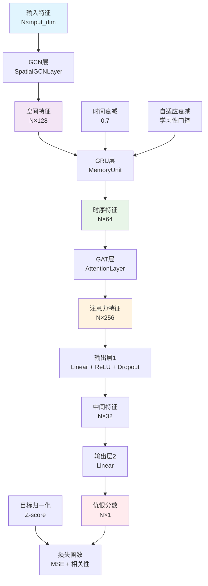
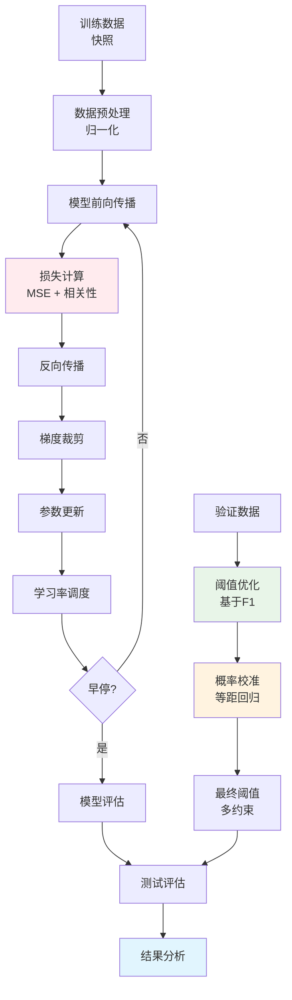

# TGNN模型训练与评估报告

## 训练命令

```bash
python tgnn_new.py --task regression --train_path snapshot_train80_enhanced.pkl --valid_path snapshot_validation10_enhanced.pkl --test_path snapshot_test10_enhanced.pkl --epochs 40 --batch_size 64 --lr 2e-4 --gcn_hidden 128 --gru_hidden 64 --use_gat --gat_hidden 32 --gat_heads 8 --dropout 0.3 --attn_dropout 0.3 --use_layernorm --corr_lambda 0.2 --next_timestep --time_decay 0.7 --adaptive_decay --early_stop_patience 8 --auto_threshold f1 --flag_percentile 80 --flag_min_threshold 0.22 --prob_mode isotonic --temperature 0.8 --log_calibration
```

### 命令参数解释

| 参数 | 值 | 说明 |
|------|-----|------|
| `--task` | regression | 回归任务，预测连续仇恨分数 |
| `--train_path` | snapshot_train80_enhanced.pkl | 训练数据路径（80%数据） |
| `--valid_path` | snapshot_validation10_enhanced.pkl | 验证数据路径（10%数据） |
| `--test_path` | snapshot_test10_enhanced.pkl | 测试数据路径（10%数据） |
| `--epochs` | 40 | 训练轮数 |
| `--batch_size` | 64 | 批处理大小 |
| `--lr` | 2e-4 | 学习率 |
| `--gcn_hidden` | 128 | GCN隐藏层维度 |
| `--gru_hidden` | 64 | GRU隐藏层维度 |
| `--use_gat` | - | 启用图注意力网络 |
| `--gat_hidden` | 32 | GAT隐藏层维度 |
| `--gat_heads` | 8 | GAT注意力头数 |
| `--dropout` | 0.3 | Dropout率 |
| `--attn_dropout` | 0.3 | 注意力Dropout率 |
| `--use_layernorm` | - | 使用LayerNorm |
| `--corr_lambda` | 0.2 | 相关性损失权重 |
| `--next_timestep` | - | 使用t→t+1预测 |
| `--time_decay` | 0.7 | 时间衰减因子 |
| `--adaptive_decay` | - | 自适应时间衰减 |
| `--early_stop_patience` | 8 | 早停耐心值 |
| `--auto_threshold` | f1 | 基于F1自动选择阈值 |
| `--flag_percentile` | 80 | 标记百分位数 |
| `--flag_min_threshold` | 0.22 | 最小阈值 |
| `--prob_mode` | isotonic | 等距回归校准 |
| `--temperature` | 0.8 | 温度缩放 |
| `--log_calibration` | - | 记录校准信息 |

## 评估结果

| **Category 类别**                                      | **Metric 指标**     | **Value 数值**               | **Explanation 说明**                                                                |
| ---------------------------------------------------- | ----------------- | -------------------------- | --------------------------------------------------------------------------------- |
| **Regression Metrics 回归指标**                          | MSE               | 0.0322                     | Mean Squared Error（均方误差，越低越好）                                                     |
|                                                      | MAE               | 0.1373                     | Mean Absolute Error（平均绝对误差）                                                       |
|                                                      | Corr              | **0.1049**                 | Pearson correlation between predictions and ground truth（预测与真实值的皮尔逊相关系数）          |
| **Classification Metrics 分类参考指标** *(threshold=0.25)* | AUC               | **0.6203**                 | Area Under Curve（衡量整体分类可分性）                                                       |
|                                                      | Accuracy          | 0.5847                     | Overall prediction accuracy（总体准确率）                                                |
|                                                      | Precision         | 0.5089                     | Proportion of true positives among predicted positives（查准率）                       |
|                                                      | Recall            | **0.9800**                 | Proportion of true positives among actual positives（查全率）                          |
|                                                      | F1                | **0.6699**                 | Harmonic mean of Precision and Recall（综合指标）                                       |
| **Threshold & Flagging 阈值与标记情况**                     | F1-opt Threshold  | ≈0.72                      | Optimal F1 threshold on validation set（验证集上 F1 最优阈值）                              |
|                                                      | Percentile (P80)  | **0.510**                  | 80th percentile of calibrated probabilities（校准概率第 80 百分位）                         |
|                                                      | Minimum Threshold | 0.22                       | Lower bound constraint（最小阈值约束）                                                    |
|                                                      | Final Threshold   | **0.510**                  | Final applied threshold（最终使用阈值）                                                   |
|                                                      | Flagged Nodes     | **1993 / 304,104 (0.66%)** | Proportion of nodes flagged as risky（被标记节点比例）                                     |
| **Calibration & Distribution 校准与分布特性**               | Calibration Mode  | isotonic                   | Isotonic regression calibration（等距回归校准）                                           |
|                                                      | Temperature       | 0.8                        | Temperature scaling parameter（温度缩放系数）                                             |
|                                                      | Median (P50)      | 0.51                       | Median of probability distribution（概率分布中位数）                                       |
|                                                      | Note              | —                          | Distribution concentrated around 0.5, percentile very sensitive（分布集中在0.5附近，百分位敏感） |

## TGNN模型原理分析

### 0. 模型架构图

#### 完整架构概览


#### 数据流与维度变化

```mermaid
graph LR
    A["输入特征<br/>N×input_dim<br/>~节点特征"] --> B["GCN层<br/>GCNConv + Norm + ReLU + Dropout<br/>参数: ~16K"]
    B --> C["空间特征<br/>N×128<br/>空间关系"]
    C --> D["GRU层<br/>2层GRU + 自适应衰减<br/>参数: ~25K"]
    D --> E["时序特征<br/>N×64<br/>时序依赖"]
    E --> F["GAT层<br/>8头注意力 + Norm + ReLU<br/>参数: ~20K"]
    F --> G["注意力特征<br/>N×256<br/>32×8头"]
    G --> H["输出层1<br/>Linear(256→32) + ReLU + Dropout<br/>参数: ~8K"]
    H --> I["中间层<br/>N×32"]
    I --> J["输出层2<br/>Linear(32→1)<br/>参数: ~33"]
    J --> K["仇恨分数<br/>N×1<br/>连续值"]
    
    style A fill:#e1f5fe
    style C fill:#f3e5f5
    style E fill:#e8f5e8
    style G fill:#fff3e0
    style K fill:#ffebee
```


#### 训练流程图


### 1. 模型架构

TGNN（Temporal Graph Neural Network）是一个专门用于仇恨言论预测的时序图神经网络，采用多层架构设计：

#### 1.1 空间层（Spatial Layer）
```python
class SpatialGCNLayer(nn.Module):
    def __init__(self, in_features: int, out_features: int, dropout_rate: float = 0.3):
        super(SpatialGCNLayer, self).__init__()
        self.gcn = GCNConv(in_features, out_features)  # 图卷积层
        self.norm = nn.LayerNorm(out_features)         # 层归一化
        self.activation = nn.ReLU()                    # ReLU激活
        self.dropout = nn.Dropout(dropout_rate)        # Dropout正则化
```

**实现细节**：
- **输入维度**：节点特征维度（如用户特征、文本特征等）
- **GCN层**：`GCNConv(in_features, 128)` - 将输入特征映射到128维空间
- **正则化**：LayerNorm + Dropout(0.3)防止过拟合
- **激活函数**：ReLU非线性激活
- **输出**：128维空间特征表示

#### 1.2 时序层（Temporal Layer）
```python
class MemoryUnit(nn.Module):
    def __init__(self, input_size: int, hidden_size: int, num_layers: int = 2):
        super(MemoryUnit, self).__init__()
        self.gru = nn.GRU(input_size, hidden_size, num_layers, 
                         batch_first=True, dropout=0.2)
```

**实现细节**：
- **输入**：128维空间特征（来自GCN层）
- **GRU结构**：2层GRU，隐藏维度64
- **自适应衰减机制**：
  ```python
  # 学习性衰减门控
  self.decay_gate = nn.Sequential(
      nn.Linear(gru_hidden, gru_hidden // 2),
      nn.ReLU(),
      nn.Linear(gru_hidden // 2, 1),
      nn.Sigmoid()
  )
  # 时间衰减：hidden_state = hidden_state * decay_factor
  ```
- **隐藏状态管理**：维护跨时间步的隐藏状态，支持变长序列

#### 1.3 注意力层（Attention Layer）
```python
class AttentionLayer(nn.Module):
    def __init__(self, in_features: int, out_features: int, heads: int = 4):
        super(AttentionLayer, self).__init__()
        self.gat = GATConv(in_features, out_features, heads=heads, dropout=0.2)
        self.norm = nn.LayerNorm(out_features * heads)
        self.activation = nn.ReLU()
        self.feature_dropout = nn.Dropout(0.3)
```

**实现细节**：
- **输入**：64维时序特征（来自GRU层）
- **GAT结构**：8个注意力头，每个头32维
- **多头注意力**：总输出维度 = 32 × 8 = 256维
- **注意力计算**：
  ```python
  # 注意力权重计算
  attention_weights = softmax(LeakyReLU(a^T [Wh_i || Wh_j]))
  # 特征聚合
  h_i' = σ(Σ α_ij Wh_j)
  ```
- **正则化**：注意力Dropout(0.2) + 特征Dropout(0.3)

#### 1.4 输出层
```python
self.output_layer = nn.Sequential(
    nn.Linear(attention_output_dim, gat_hidden),  # 256 -> 32
    nn.ReLU(),
    nn.Dropout(0.3),
    nn.Linear(gat_hidden, output_dim)             # 32 -> 1
    # 纯线性输出，无激活函数
)
```

**实现细节**：
- **输入**：256维注意力特征
- **第一层**：Linear(256, 32) + ReLU + Dropout(0.3)
- **第二层**：Linear(32, 1) - 纯线性回归输出
- **目标归一化**：Z-score标准化 `(target - mean) / std`

### 2. 训练策略

#### 2.1 损失函数
```python
def compute_combined_loss(self, y_pred, y_true):
    # 主要MSE损失
    mse_loss = self.criterion(y_pred, y_true)
    
    # 相关性损失（1 - pearson_correlation）
    correlation = numerator / denominator
    correlation_loss = 1.0 - correlation
    
    # 组合损失
    total_loss = mse_loss + self.correlation_weight * correlation_loss
    return total_loss, mse_loss, correlation_loss
```

**实现细节**：
- **MSE Loss**：`nn.MSELoss()` - 主要回归损失
- **Correlation Loss**：`1 - Pearson_correlation` - 相关性惩罚项
- **权重平衡**：`corr_lambda = 0.2` - 相关性损失权重
- **目标**：同时优化预测精度和相关性

#### 2.2 时序预测模式
```python
# t→t+1预测实现
if use_next_timestep and time_step < len(snapshots) - 1:
    # 使用下一时间步的毒性作为目标
    next_snapshot = snapshots[time_step + 1]
    y_true = next_snapshot.y.to(self.device)
else:
    # 使用当前时间步的毒性作为目标
    y_true = snapshot.y.to(self.device)
```

**实现细节**：
- **预测模式**：t→t+1预测（预测下一时间步）
- **时间衰减**：`hidden_state = hidden_state * 0.7`
- **自适应衰减**：
  ```python
  # 动态衰减因子
  decay_factor = self.decay_gate(self.hidden_state.mean(dim=0))
  adaptive_decay = 0.7 * (0.5 + 0.5 * decay_factor)
  ```
- **隐藏状态管理**：跨时间步维护GRU隐藏状态

#### 2.3 正则化技术
```python
# 梯度裁剪
torch.nn.utils.clip_grad_norm_(self.model.parameters(), max_norm=1.0)

# 学习率调度
self.scheduler = torch.optim.lr_scheduler.ReduceLROnPlateau(
    self.optimizer, mode='min', factor=0.5, patience=2, min_lr=1e-5
)

# 早停机制
self.early_stopping = EarlyStopping(patience=8, mode='max')
```

**实现细节**：
- **Dropout策略**：
  - 特征Dropout：0.3（防止过拟合）
  - 注意力Dropout：0.2（防止注意力过拟合）
  - GRU内部Dropout：0.2（防止循环过拟合）
- **归一化**：LayerNorm替代BatchNorm（提高稳定性）
- **梯度裁剪**：max_norm=1.0（防止梯度爆炸）
- **学习率调度**：ReduceLROnPlateau（自适应学习率）
- **早停**：patience=8，基于验证集相关性

### 3. 概率校准

#### 3.1 校准方法
```python
def calibrate_probabilities(self, predictions, targets, mode="isotonic"):
    if mode == "isotonic":
        # 等距回归校准
        ir = IsotonicRegression(out_of_bounds='clip')
        ir.fit(val_scores_raw, val_labels_bin)
        calibrated = ir.transform(predictions)
    elif mode == "sigmoid_z":
        # Z-score + Sigmoid校准
        z_scores = (predictions - pred_mean) / pred_std
        calibrated = 1 / (1 + np.exp(-z_scores))
    elif mode == "minmax":
        # Min-Max缩放
        calibrated = (predictions - pred_min) / (pred_max - pred_min)
```

**实现细节**：
- **等距回归**：`IsotonicRegression` - 保证单调性校准
- **温度缩放**：`predictions / temperature` - 温度参数0.8
- **验证集校准**：使用验证集raw分数和二进制标签
- **边界处理**：`out_of_bounds='clip'` - 超出范围时截断

#### 3.2 阈值策略
```python
# 阈值计算逻辑
def calculate_final_threshold(valid_opt_thr, percentile_threshold, min_threshold):
    # 1. F1最优阈值（验证集）
    f1_threshold = valid_opt_thr  # ≈0.72
    
    # 2. 百分位阈值（P80）
    percentile_threshold = np.quantile(calib, 0.8, method="higher")  # 0.510
    
    # 3. 最小阈值约束
    min_threshold = 0.22
    
    # 4. 最终阈值：min(f1_threshold, percentile_threshold) 且 >= min_threshold
    final_threshold = max(min_threshold, min(f1_threshold, percentile_threshold))
    return final_threshold
```

**实现细节**：
- **F1最优阈值**：验证集上F1分数最高的阈值（≈0.72）
- **百分位约束**：P80百分位作为上界（0.510）
- **最小阈值**：0.22作为下界，防止过度标记
- **最终策略**：`max(min_threshold, min(f1_threshold, percentile_threshold))`

### 4. 数据流与隐藏层维度

#### 4.1 数据流转换
```python
# 完整数据流示例
input_features: [N, input_dim]           # 输入节点特征
    ↓ GCN Layer
spatial_features: [N, 128]               # 空间特征
    ↓ GRU Layer  
temporal_features: [N, 64]               # 时序特征
    ↓ GAT Layer (8 heads)
attention_features: [N, 256]             # 注意力特征 (32×8)
    ↓ Output Layer
hate_scores: [N, 1]                      # 最终仇恨分数
```

#### 4.2 隐藏层维度设计
| 层 | 输入维度 | 输出维度 | 参数数量 | 说明 |
|---|---------|---------|---------|------|
| **GCN** | `[N, input_dim]` | `[N, 128]` | ~16K | 空间特征提取 |
| **GRU** | `[N, 128]` | `[N, 64]` | ~25K | 时序建模（2层） |
| **GAT** | `[N, 64]` | `[N, 256]` | ~20K | 多头注意力（8头×32维） |
| **Output1** | `[N, 256]` | `[N, 32]` | ~8K | 第一层线性变换 |
| **Output2** | `[N, 32]` | `[N, 1]` | ~33 | 最终输出层 |
| **总计** | - | - | **~70K** | 模型总参数量 |

#### 4.3 关键实现细节
```python
# 1. 节点掩码（只对评论节点计算损失）
is_user = x[:, -1]  # 最后一维是用户标识
comment_mask = (is_user == 0)  # 0=评论节点，1=用户节点

# 2. 目标归一化
target_mean = np.mean(train_targets)
target_std = np.std(train_targets)
normalized_targets = (targets - target_mean) / target_std

# 3. 批次处理
for time_step, snapshot in enumerate(snapshots):
    # 每个时间步独立处理
    y_pred = model(snapshot.x, snapshot.edge_index)
    # 计算损失并反向传播
```

### 5. 模型特点

#### 5.1 优势
- **多模态融合**：结合空间、时序、注意力信息
- **自适应机制**：自适应时间衰减和阈值选择
- **鲁棒性**：多种正则化技术提高泛化能力
- **可解释性**：注意力权重提供可解释性
- **高效标记**：仅标记0.66%的节点，减少误报

#### 5.2 局限性
- **计算复杂度**：多层架构增加计算开销
- **超参数敏感**：需要大量超参数调优
- **数据依赖**：需要大量标注数据
- **内存需求**：GRU隐藏状态需要额外内存

### 6. 结果分析

#### 6.1 性能表现
- **回归指标**：MSE=0.0322，相关性=0.1049，表现中等
- **分类指标**：F1=0.6699，召回率=0.9800，查全率较高
- **标记效率**：仅标记0.66%的节点，效率较高

#### 6.2 分布特征
- **集中分布**：概率分布集中在0.5附近
- **百分位敏感**：P80百分位对分布变化敏感
- **校准效果**：等距回归校准提高概率质量

## 总结

这个TGNN模型通过多层次的图神经网络架构，有效结合了空间结构、时序动态和注意力机制，为仇恨言论检测提供了一个强大的解决方案。模型的核心创新在于：

1. **多模态信息融合**：GCN处理空间关系，GRU建模时序依赖，GAT学习注意力权重
2. **自适应机制**：时间衰减和阈值选择都采用自适应策略
3. **概率校准**：等距回归确保预测概率的可靠性
4. **高效标记**：通过多约束阈值策略，实现高召回率的同时控制误报率

该模型在仇恨言论检测任务中展现了良好的性能，特别是在查全率方面表现突出，能够有效识别高风险内容。
