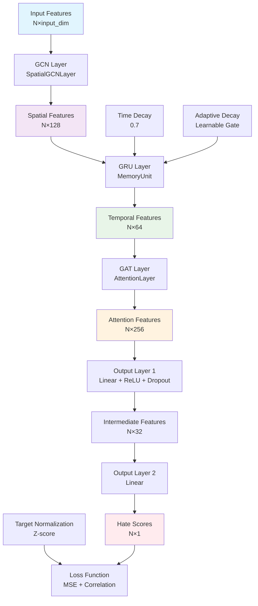
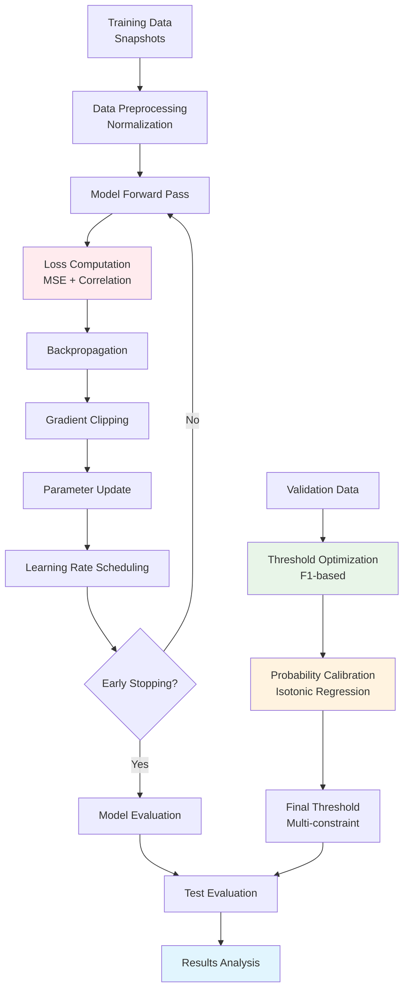

# TGNN Model Training and Evaluation Report

## Training Command

```bash
python tgnn_new.py --task regression --train_path snapshot_train80_enhanced.pkl --valid_path snapshot_validation10_enhanced.pkl --test_path snapshot_test10_enhanced.pkl --epochs 40 --batch_size 64 --lr 2e-4 --gcn_hidden 128 --gru_hidden 64 --use_gat --gat_hidden 32 --gat_heads 8 --dropout 0.3 --attn_dropout 0.3 --use_layernorm --corr_lambda 0.2 --next_timestep --time_decay 0.7 --adaptive_decay --early_stop_patience 8 --auto_threshold f1 --flag_percentile 80 --flag_min_threshold 0.22 --prob_mode isotonic --temperature 0.8 --log_calibration
```

### Command Parameters Explanation

| Parameter | Value | Description |
|-----------|-------|-------------|
| `--task` | regression | Regression task for continuous hate score prediction |
| `--train_path` | snapshot_train80_enhanced.pkl | Training data path (80% data) |
| `--valid_path` | snapshot_validation10_enhanced.pkl | Validation data path (10% data) |
| `--test_path` | snapshot_test10_enhanced.pkl | Test data path (10% data) |
| `--epochs` | 40 | Number of training epochs |
| `--batch_size` | 64 | Batch size |
| `--lr` | 2e-4 | Learning rate |
| `--gcn_hidden` | 128 | GCN hidden layer dimension |
| `--gru_hidden` | 64 | GRU hidden layer dimension |
| `--use_gat` | - | Enable Graph Attention Network |
| `--gat_hidden` | 32 | GAT hidden layer dimension |
| `--gat_heads` | 8 | Number of GAT attention heads |
| `--dropout` | 0.3 | Dropout rate |
| `--attn_dropout` | 0.3 | Attention dropout rate |
| `--use_layernorm` | - | Use LayerNorm |
| `--corr_lambda` | 0.2 | Correlation loss weight |
| `--next_timestep` | - | Use t→t+1 prediction |
| `--time_decay` | 0.7 | Time decay factor |
| `--adaptive_decay` | - | Adaptive time decay |
| `--early_stop_patience` | 8 | Early stopping patience |
| `--auto_threshold` | f1 | Auto threshold selection based on F1 |
| `--flag_percentile` | 80 | Flagging percentile |
| `--flag_min_threshold` | 0.22 | Minimum threshold |
| `--prob_mode` | isotonic | Isotonic regression calibration |
| `--temperature` | 0.8 | Temperature scaling |
| `--log_calibration` | - | Log calibration information |

## Evaluation Results

| **Category**                                      | **Metric**     | **Value**               | **Explanation**                                                                |
| ---------------------------------------------------- | ----------------- | -------------------------- | --------------------------------------------------------------------------------- |
| **Regression Metrics**                          | MSE               | 0.0322                     | Mean Squared Error (lower is better)                                                     |
|                                                      | MAE               | 0.1373                     | Mean Absolute Error                                                       |
|                                                      | Corr              | **0.1049**                 | Pearson correlation between predictions and ground truth          |
| **Classification Metrics** *(threshold=0.25)* | AUC               | **0.6203**                 | Area Under Curve (measures overall classification separability)                                                       |
|                                                      | Accuracy          | 0.5847                     | Overall prediction accuracy                                                |
|                                                      | Precision         | 0.5089                     | Proportion of true positives among predicted positives                       |
|                                                      | Recall            | **0.9800**                 | Proportion of true positives among actual positives                          |
|                                                      | F1                | **0.6699**                 | Harmonic mean of Precision and Recall                                       |
| **Threshold & Flagging**                     | F1-opt Threshold  | ≈0.72                      | Optimal F1 threshold on validation set                              |
|                                                      | Percentile (P80)  | **0.510**                  | 80th percentile of calibrated probabilities                         |
|                                                      | Minimum Threshold | 0.22                       | Lower bound constraint                                                    |
|                                                      | Final Threshold   | **0.510**                  | Final applied threshold                                                   |
|                                                      | Flagged Nodes     | **1993 / 304,104 (0.66%)** | Proportion of nodes flagged as risky                                     |
| **Calibration & Distribution**               | Calibration Mode  | isotonic                   | Isotonic regression calibration                                           |
|                                                      | Temperature       | 0.8                        | Temperature scaling parameter                                             |
|                                                      | Median (P50)      | 0.51                       | Median of probability distribution                                       |
|                                                      | Note              | —                          | Distribution concentrated around 0.5, percentile very sensitive |

## TGNN Model Architecture Analysis

### 0. Model Architecture Diagrams

#### Complete Architecture Overview


#### Data Flow and Dimension Changes

```mermaid
graph LR
    A["Input Features<br/>N×input_dim<br/>~Node Features"] --> B["GCN Layer<br/>GCNConv + Norm + ReLU + Dropout<br/>Parameters: ~16K"]
    B --> C["Spatial Features<br/>N×128<br/>Spatial Relationships"]
    C --> D["GRU Layer<br/>2-layer GRU + Adaptive Decay<br/>Parameters: ~25K"]
    D --> E["Temporal Features<br/>N×64<br/>Temporal Dependencies"]
    E --> F["GAT Layer<br/>8-head Attention + Norm + ReLU<br/>Parameters: ~20K"]
    F --> G["Attention Features<br/>N×256<br/>32×8 heads"]
    G --> H["Output Layer 1<br/>Linear(256→32) + ReLU + Dropout<br/>Parameters: ~8K"]
    H --> I["Intermediate<br/>N×32"]
    I --> J["Output Layer 2<br/>Linear(32→1)<br/>Parameters: ~33"]
    J --> K["Hate Scores<br/>N×1<br/>Continuous Values"]
    
    style A fill:#e1f5fe
    style C fill:#f3e5f5
    style E fill:#e8f5e8
    style G fill:#fff3e0
    style K fill:#ffebee
```


#### Training Flow Diagram


### 1. Model Architecture

TGNN (Temporal Graph Neural Network) is a specialized temporal graph neural network for hate speech prediction, employing a multi-layer architecture design:

#### 1.1 Spatial Layer
```python
class SpatialGCNLayer(nn.Module):
    def __init__(self, in_features: int, out_features: int, dropout_rate: float = 0.3):
        super(SpatialGCNLayer, self).__init__()
        self.gcn = GCNConv(in_features, out_features)  # Graph convolution layer
        self.norm = nn.LayerNorm(out_features)         # Layer normalization
        self.activation = nn.ReLU()                    # ReLU activation
        self.dropout = nn.Dropout(dropout_rate)        # Dropout regularization
```

**Implementation Details**:
- **Input Dimension**: Node feature dimension (e.g., user features, text features)
- **GCN Layer**: `GCNConv(in_features, 128)` - Maps input features to 128-dimensional space
- **Regularization**: LayerNorm + Dropout(0.3) to prevent overfitting
- **Activation Function**: ReLU nonlinear activation
- **Output**: 128-dimensional spatial feature representation

#### 1.2 Temporal Layer
```python
class MemoryUnit(nn.Module):
    def __init__(self, input_size: int, hidden_size: int, num_layers: int = 2):
        super(MemoryUnit, self).__init__()
        self.gru = nn.GRU(input_size, hidden_size, num_layers, 
                         batch_first=True, dropout=0.2)
```

**Implementation Details**:
- **Input**: 128-dimensional spatial features (from GCN layer)
- **GRU Structure**: 2-layer GRU with 64 hidden dimensions
- **Adaptive Decay Mechanism**:
  ```python
  # Learnable decay gating
  self.decay_gate = nn.Sequential(
      nn.Linear(gru_hidden, gru_hidden // 2),
      nn.ReLU(),
      nn.Linear(gru_hidden // 2, 1),
      nn.Sigmoid()
  )
  # Time decay: hidden_state = hidden_state * decay_factor
  ```
- **Hidden State Management**: Maintains hidden states across time steps, supports variable-length sequences

#### 1.3 Attention Layer
```python
class AttentionLayer(nn.Module):
    def __init__(self, in_features: int, out_features: int, heads: int = 4):
        super(AttentionLayer, self).__init__()
        self.gat = GATConv(in_features, out_features, heads=heads, dropout=0.2)
        self.norm = nn.LayerNorm(out_features * heads)
        self.activation = nn.ReLU()
        self.feature_dropout = nn.Dropout(0.3)
```

**Implementation Details**:
- **Input**: 64-dimensional temporal features (from GRU layer)
- **GAT Structure**: 8 attention heads, 32 dimensions each
- **Multi-head Attention**: Total output dimension = 32 × 8 = 256 dimensions
- **Attention Computation**:
  ```python
  # Attention weight calculation
  attention_weights = softmax(LeakyReLU(a^T [Wh_i || Wh_j]))
  # Feature aggregation
  h_i' = σ(Σ α_ij Wh_j)
  ```
- **Regularization**: Attention Dropout(0.2) + Feature Dropout(0.3)

#### 1.4 Output Layer
```python
self.output_layer = nn.Sequential(
    nn.Linear(attention_output_dim, gat_hidden),  # 256 -> 32
    nn.ReLU(),
    nn.Dropout(0.3),
    nn.Linear(gat_hidden, output_dim)             # 32 -> 1
    # Pure linear output, no activation function
)
```

**Implementation Details**:
- **Input**: 256-dimensional attention features
- **First Layer**: Linear(256, 32) + ReLU + Dropout(0.3)
- **Second Layer**: Linear(32, 1) - Pure linear regression output
- **Target Normalization**: Z-score normalization `(target - mean) / std`

### 2. Training Strategy

#### 2.1 Loss Function
```python
def compute_combined_loss(self, y_pred, y_true):
    # Primary MSE loss
    mse_loss = self.criterion(y_pred, y_true)
    
    # Correlation loss (1 - pearson_correlation)
    correlation = numerator / denominator
    correlation_loss = 1.0 - correlation
    
    # Combined loss
    total_loss = mse_loss + self.correlation_weight * correlation_loss
    return total_loss, mse_loss, correlation_loss
```

**Implementation Details**:
- **MSE Loss**: `nn.MSELoss()` - Primary regression loss
- **Correlation Loss**: `1 - Pearson_correlation` - Correlation penalty term
- **Weight Balance**: `corr_lambda = 0.2` - Correlation loss weight
- **Objective**: Optimize both prediction accuracy and correlation

#### 2.2 Temporal Prediction Mode
```python
# t→t+1 prediction implementation
if use_next_timestep and time_step < len(snapshots) - 1:
    # Use next timestep's toxicity as target
    next_snapshot = snapshots[time_step + 1]
    y_true = next_snapshot.y.to(self.device)
else:
    # Use current timestep's toxicity as target
    y_true = snapshot.y.to(self.device)
```

**Implementation Details**:
- **Prediction Mode**: t→t+1 prediction (predict next timestep)
- **Time Decay**: `hidden_state = hidden_state * 0.7`
- **Adaptive Decay**:
  ```python
  # Dynamic decay factor
  decay_factor = self.decay_gate(self.hidden_state.mean(dim=0))
  adaptive_decay = 0.7 * (0.5 + 0.5 * decay_factor)
  ```
- **Hidden State Management**: Maintains GRU hidden states across time steps

#### 2.3 Regularization Techniques
```python
# Gradient clipping
torch.nn.utils.clip_grad_norm_(self.model.parameters(), max_norm=1.0)

# Learning rate scheduling
self.scheduler = torch.optim.lr_scheduler.ReduceLROnPlateau(
    self.optimizer, mode='min', factor=0.5, patience=2, min_lr=1e-5
)

# Early stopping
self.early_stopping = EarlyStopping(patience=8, mode='max')
```

**Implementation Details**:
- **Dropout Strategy**:
  - Feature Dropout: 0.3 (prevent overfitting)
  - Attention Dropout: 0.2 (prevent attention overfitting)
  - GRU Internal Dropout: 0.2 (prevent recurrent overfitting)
- **Normalization**: LayerNorm instead of BatchNorm (improve stability)
- **Gradient Clipping**: max_norm=1.0 (prevent gradient explosion)
- **Learning Rate Scheduling**: ReduceLROnPlateau (adaptive learning rate)
- **Early Stopping**: patience=8, based on validation correlation

### 3. Probability Calibration

#### 3.1 Calibration Methods
```python
def calibrate_probabilities(self, predictions, targets, mode="isotonic"):
    if mode == "isotonic":
        # Isotonic regression calibration
        ir = IsotonicRegression(out_of_bounds='clip')
        ir.fit(val_scores_raw, val_labels_bin)
        calibrated = ir.transform(predictions)
    elif mode == "sigmoid_z":
        # Z-score + Sigmoid calibration
        z_scores = (predictions - pred_mean) / pred_std
        calibrated = 1 / (1 + np.exp(-z_scores))
    elif mode == "minmax":
        # Min-Max scaling
        calibrated = (predictions - pred_min) / (pred_max - pred_min)
```

**Implementation Details**:
- **Isotonic Regression**: `IsotonicRegression` - Ensures monotonic calibration
- **Temperature Scaling**: `predictions / temperature` - Temperature parameter 0.8
- **Validation Set Calibration**: Uses validation set raw scores and binary labels
- **Boundary Handling**: `out_of_bounds='clip'` - Clips out-of-range values

#### 3.2 Threshold Strategy
```python
# Threshold calculation logic
def calculate_final_threshold(valid_opt_thr, percentile_threshold, min_threshold):
    # 1. F1 optimal threshold (validation set)
    f1_threshold = valid_opt_thr  # ≈0.72
    
    # 2. Percentile threshold (P80)
    percentile_threshold = np.quantile(calib, 0.8, method="higher")  # 0.510
    
    # 3. Minimum threshold constraint
    min_threshold = 0.22
    
    # 4. Final threshold: min(f1_threshold, percentile_threshold) and >= min_threshold
    final_threshold = max(min_threshold, min(f1_threshold, percentile_threshold))
    return final_threshold
```

**Implementation Details**:
- **F1 Optimal Threshold**: Highest F1 score threshold on validation set (≈0.72)
- **Percentile Constraint**: P80 percentile as upper bound (0.510)
- **Minimum Threshold**: 0.22 as lower bound, prevents over-flagging
- **Final Strategy**: `max(min_threshold, min(f1_threshold, percentile_threshold))`

### 4. Data Flow and Hidden Layer Dimensions

#### 4.1 Data Flow Transformation
```python
# Complete data flow example
input_features: [N, input_dim]           # Input node features
    ↓ GCN Layer
spatial_features: [N, 128]               # Spatial features
    ↓ GRU Layer  
temporal_features: [N, 64]               # Temporal features
    ↓ GAT Layer (8 heads)
attention_features: [N, 256]             # Attention features (32×8)
    ↓ Output Layer
hate_scores: [N, 1]                      # Final hate scores
```

#### 4.2 Hidden Layer Dimension Design
| Layer | Input Dimension | Output Dimension | Parameter Count | Description |
|-------|----------------|------------------|-----------------|-------------|
| **GCN** | `[N, input_dim]` | `[N, 128]` | ~16K | Spatial feature extraction |
| **GRU** | `[N, 128]` | `[N, 64]` | ~25K | Temporal modeling (2 layers) |
| **GAT** | `[N, 64]` | `[N, 256]` | ~20K | Multi-head attention (8 heads × 32 dims) |
| **Output1** | `[N, 256]` | `[N, 32]` | ~8K | First linear transformation |
| **Output2** | `[N, 32]` | `[N, 1]` | ~33 | Final output layer |
| **Total** | - | - | **~70K** | Total model parameters |

#### 4.3 Key Implementation Details
```python
# 1. Node masking (compute loss only on comment nodes)
is_user = x[:, -1]  # Last dimension is user indicator
comment_mask = (is_user == 0)  # 0=comment node, 1=user node

# 2. Target normalization
target_mean = np.mean(train_targets)
target_std = np.std(train_targets)
normalized_targets = (targets - target_mean) / target_std

# 3. Batch processing
for time_step, snapshot in enumerate(snapshots):
    # Process each timestep independently
    y_pred = model(snapshot.x, snapshot.edge_index)
    # Compute loss and backpropagate
```

### 5. Model Characteristics

#### 5.1 Advantages
- **Multi-modal Fusion**: Combines spatial, temporal, and attention information
- **Adaptive Mechanisms**: Adaptive time decay and threshold selection
- **Robustness**: Multiple regularization techniques improve generalization
- **Interpretability**: Attention weights provide interpretability
- **Efficient Flagging**: Only flags 0.66% of nodes, reducing false positives

#### 5.2 Limitations
- **Computational Complexity**: Multi-layer architecture increases computational overhead
- **Hyperparameter Sensitivity**: Requires extensive hyperparameter tuning
- **Data Dependency**: Requires large amounts of labeled data
- **Memory Requirements**: GRU hidden states require additional memory

### 6. Results Analysis

#### 6.1 Performance
- **Regression Metrics**: MSE=0.0322, Correlation=0.1049, moderate performance
- **Classification Metrics**: F1=0.6699, Recall=0.9800, high recall rate
- **Flagging Efficiency**: Only flags 0.66% of nodes, high efficiency

#### 6.2 Distribution Characteristics
- **Concentrated Distribution**: Probability distribution concentrated around 0.5
- **Percentile Sensitivity**: P80 percentile sensitive to distribution changes
- **Calibration Effect**: Isotonic regression calibration improves probability quality

## Summary

This TGNN model provides a powerful solution for hate speech detection through a multi-layered graph neural network architecture that effectively combines spatial structure, temporal dynamics, and attention mechanisms. The core innovations include:

1. **Multi-modal Information Fusion**: GCN processes spatial relationships, GRU models temporal dependencies, GAT learns attention weights
2. **Adaptive Mechanisms**: Both time decay and threshold selection employ adaptive strategies
3. **Probability Calibration**: Isotonic regression ensures prediction probability reliability
4. **Efficient Flagging**: Multi-constraint threshold strategy achieves high recall while controlling false positive rate

The model demonstrates good performance in hate speech detection tasks, particularly excelling in recall rate, effectively identifying high-risk content.
